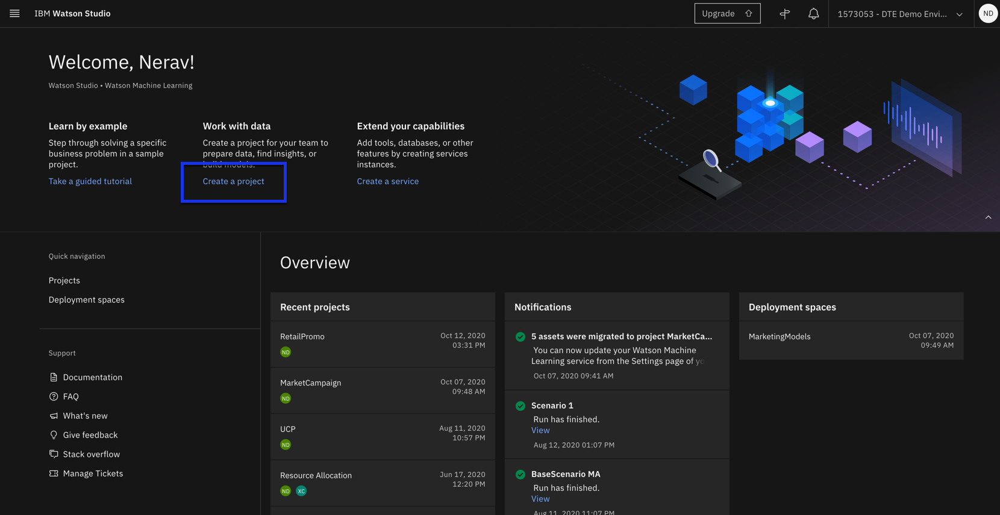
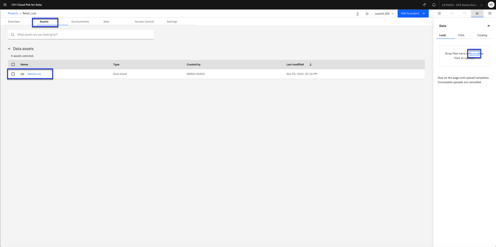
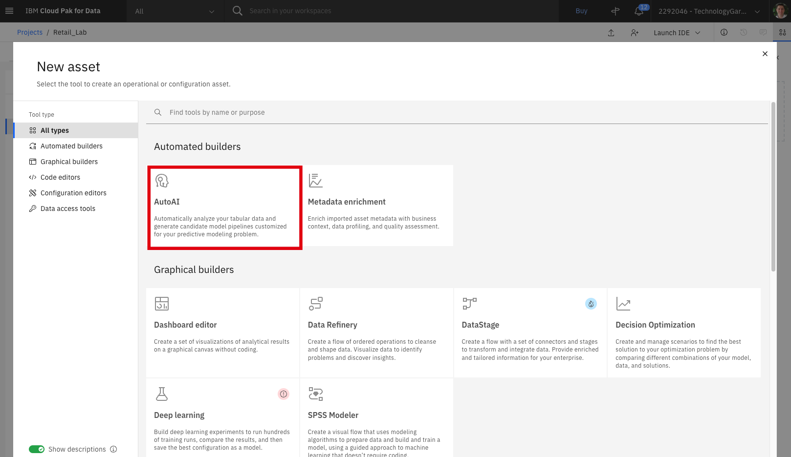

# Create AutoAI model

Watson Studio is an integrated platform designed to organize your project assets, like data sets, collaborators, models, notebooks. You are going to use Watson Studio to create a project in which you train a model with AutoAI and deploy this trained model.

### Step 1. Create a Watson Studio project
- Click Create a Project.
- Select Create an empty project.
- Name your project. If you have a Cloud Lite account, the Object Storage service you created in the previous step will be selected automatically.Otherwise, select a service from the drop-down menu and Click Create.

### Step 2. Add data to the project
- Click the Assets tab. The right-side window shows a load tab.Click the browse link and select the demos.csv file from the folder. Click Open and the file is uploaded in cloud object storage

Click demos.csv under Data assets. You can preview the first 1000 rows and all the columns for historical promotion data. Scroll on the right to look at all the columns. This is historical promotion dataset by store location
where the increase denotes the historical percentage increase in customer demand when there was any promotion. Click the Retail_lab on the top to go back to the project.

## Step3. Create an AutoAI experiment

In this step, we will learn to use the IBM AutoAI capability to automatically select and build without coding. In the retail example we would use the increase column from demo dataset to understand the impact of promotion on customer demand.

- Click Add to project in the upper-right of the screen. In the asset type screen, click AutoAI experiment.

- Create the experiment. Give name example:***Promotion_prediction***. Click Create.Note: ***If you have a Cloud Lite account, the Object Storage service you created in the previous step will be selected automatically.Otherwise, select a service from the drop-down menu*** and Click Create.
- Now we need to select the data that will be used to train the model. Click Select from project. Our project has only one file. Click the demos.csv, then click Select asset.
- Now let's select the target attribute.In the Select column to predict window Click the scroll bar. Click Increase field to identify it as the target attribute.
- Click Run Experiment. Based on the column selected AutoAI automatically selects the optimized metric and starts preparing to build the model. Note you have the option to change experiment settings

- You can see that Auto AI selects the model and on top of it does additional hyper parameter optimization and feature engineering on top of it. You can scroll at the bottom to see top pipelines that are built. AutoAI selects from more than 44 different models and selects the
